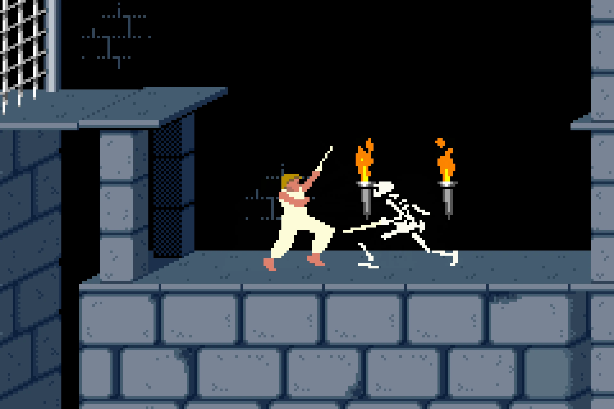

# About

Albedo is a theme for EmulationStation. It's a fork of [Elementerial](https://github.com/mluizvitor/es-theme-elementerial), another ES theme built by me.
It has flat surfaces, plays with transparency and sharp edges.

> This theme supports custom backgrounds. I made an web app to load, crop and save images named as the designated system.
> It's not powerful as Photoshop or GIMP, but help collect a lot of images and download them in one go. 
> 
> [Albedo Wallpaper Cropper](https://albedo-wallpaper-cropper.vercel.app). If you're concerned about privacy, this web app will never collect or send any information anywhere. The images loaded are saved locally on the browser database. As an web app, it can be used offline after the first load.

# Compatibility

Created for and tested on the following resolutions:
- **480x320** (3:2 screen ratio), tested on Anbernic RG351M running AmberELEC
- **640x480** (4:3 screen ratio), tested on VirtualBox running Batocera
- **1920x1152** (5:3 screen ratio), tested on VirtualBox running Batocera

Albedo was made for [AmberELEC](https://amberelec.org) supported devices, as RG351P/M/V/MP, RG552, but can be used on other systems running EmulationStation (no guarantee).

 

# Screenshots
|    |                                      |
| :-----------------------: | :---------------------------------------------------------: |
| Colored Logos + Scanlines | Monochromatic Logos + Green accent color. Removed scanlines |

|          |                                       |
| :-----------------------------: | :----------------------------------------------------------: |
| Grid view + Purple accent color | Detailed view + Yellow accent color + Background not blurred |

|                                 |          |
| :----------------------------------------------------: | :-----------------------------: |
| Basic view + Blue accent color + No console background | System Menu + Pink accent color |

 

# Tweaks

You can choose between 10 accent colors:

Set background style for game list:

|  |  |  |
| :--------------------------------------------------: | :--------------------------------------------------------------------: | :-------------------------------------------------------------: |
|                  Normal background                   |                           Blurred Background                           |                          No background                          |

 

Set background overlay:

|  |  |
| :--------------------------------------: | :-----------------------------------: |
|                Scanlines                 |                 Clean                 |

 

Load your own custom backgrounds:

> Please, read [CUSTOMBG.md](CUSTOMBG.md) for more details.

|  |  |
| :---------------------------------------------: | :-------------------------------------------: |
|               Default background                |               Custom Background               |

And many more.

 

# Supported Platforms

  

3DO,
Adventure Vision,
Amiga,
Amiga CD32,
Amstrad CPC,
Arduboy,
Atari 800,
Atari 2600,
Atari 5200,
Atari 7800,
Atari Jaguar,
Atari Lynx,
Atari ST,
Atomiswave,
Build Engine,
Casio PV-1000,
Channel F,
CHIP-8,
ColecoVision,
Commodore 16,
Commodore 64,
Commodore 128,
Doom,
Dreamcast,
EasyRPG,
Epoch PC 64/128,
Famicom,
Famicom Disk System,
FinalBurn Neo,
Gamate,
GameKing,
Game & Watch,
Game Boy Advance and Hacks,
Game Boy and Hacks,
Game Boy Color and Hacks,
Game Gear and Hacks,
Game Master,
Game Pocket Computer,
Genesis and Hacks,
Homebrew,
Intellivision,
J2ME,
LaserDisc,
LowRes NX,
MAME,
Master System,
Mega-CD,
Mega Drive and Hacks,
Mega Duck,
Microsoft DOS,
MSX,
MSX2,
Naomi,
Neo Geo,
Neo Geo CD,
Neo Geo Pocket,
Neo Geo Pocket Color,
Nintendo 64,
Nintendo DS,
Nintendo Entertainment System and Hacks,
Odyssey²,
OpenBOR,
PC-88,
PC-98,
PC-FX,
PC Engine,
PC Engine CD,
Philips CD-i,
Pico-8,
Pokémon Mini,
Ports,
PlayStation,
PSP,
PSP Minis,
P/ECE,
Satellaview,
Saturn,
ScummVM,
Sega 32X,
Sega CD,
Sega SC-3000,
Sega SG-1000,
Super Cassette Vision,
Super Famicom,
Sharp X1,
Sharp x68000,
Sinclair ZX81,
Sinclari ZX Spectrum,
Super Nintendo and Hacks, 
Super Nintendo MSU-1,
Solarus,
SuFami Turbo,
SuperGrafx,
Supervision,
TurboGrafx 16,
TurboGrafx CD,
TIC-80,
TV-Computer,
Uzebox,
Vectrex,
VIC-20,
VideoPac,
Virtual Boy,
WASM-4,
Wolfenstein 3D,
Wonderswan,
Wonderswan Color,
Z-Machine.

 

2 Players,
4 Players,
All Games,
Arcade,
Custom Collections,
Favorites,
Last Played,
Lightgun Games,
MPlayer,
Never Played,
Retro Achievements,
Screenshots,
System Tools,
Vertical Arcade.

 

# License

All [videogame and computer system logos](./assets/logos/) used are the property of their respective Developers/Producers/Distributors/Licensors.

Some logos were taken from [Dan Patrick's set](https://archive.org/details/console-logos-professionally-redrawn-plus-official-versions). (Thanks for the great work).

[Fonts](./assets/fonts/) are licensed under Open Font License.

[Icons](./assets/icons/) are taken from [Pictogrammers](https://pictogrammers.com/library/mdi/). (Previously *Material Icons Community*)

All the files, code and images not mentioned above are licensed under the [MIT License](./LICENSE).

 

# Made With

